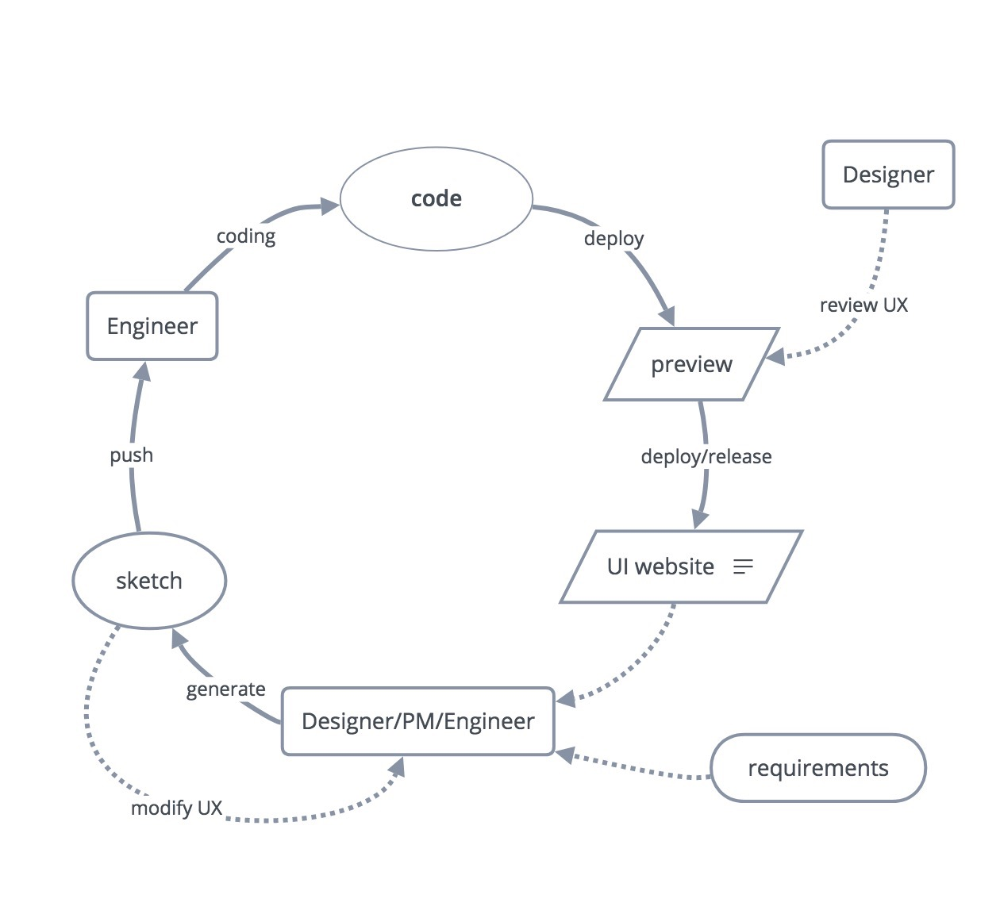
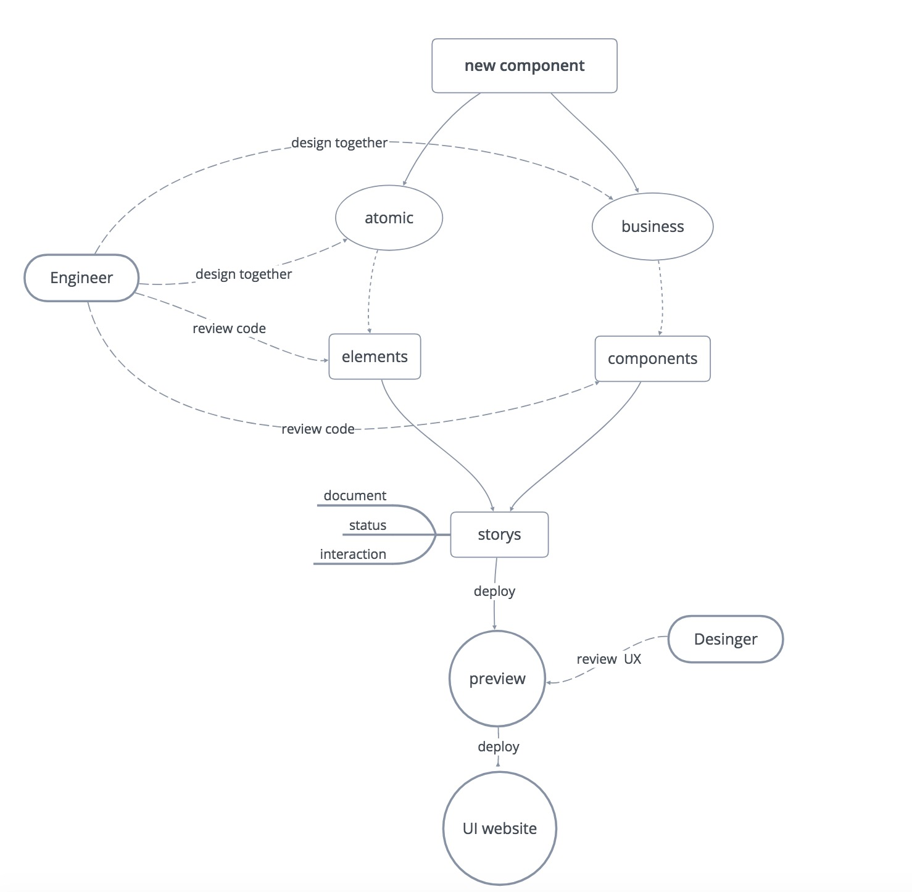

# RingCentral UI Component Lib

## Get Started

```shell
yarn

yarn start # the server is listening on port `6006` by default.

yarn build # build your website to static source
```

## Cooperation process


## Development process


### Write your stories

## Unit Test
